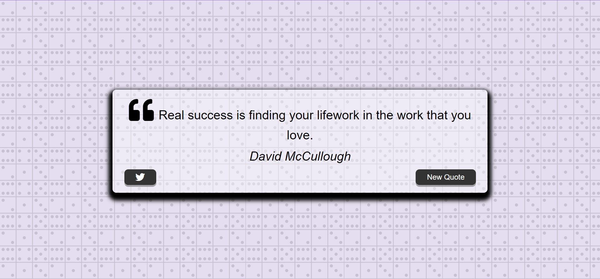

# QuoteGenerator

- In this task I have done Generate new Quote By clicking and I Learnt async await Concept of this and I have only done Logic part not css.

- I also Learnt How  to put loader while Generating new Quote.